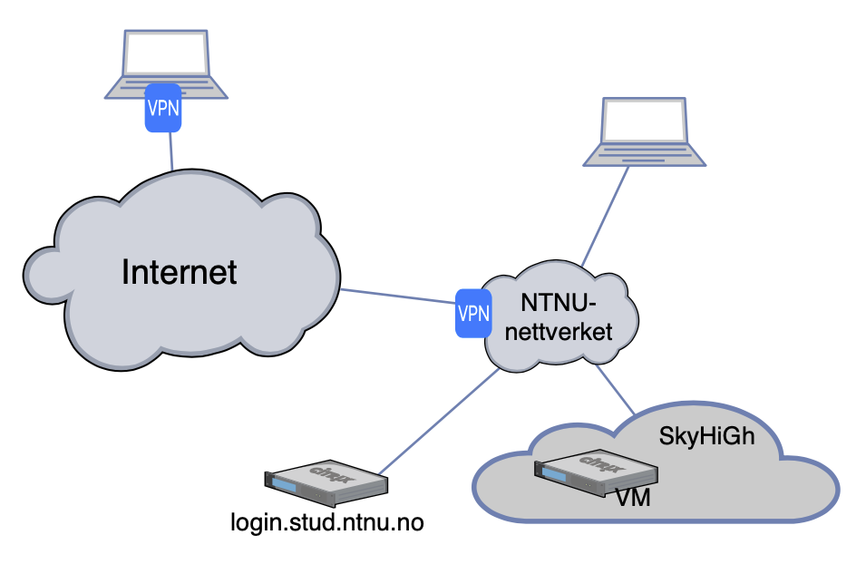

# About the Lab Exercises

The lab exercises will be carried out using the OpenStack implementation SkyHiGh at NTNU located at https://skyhigh.iik.ntnu.no. You should be able to login to the service using your NTNU account. However, to access SkyHiGh you need to be connected to the NTNU network. From outside NTNU you need go through a VPN tunnel or login.stud.ntnu.no.

In this folder you'll find the labs, which contains lab tutorials and review questions. Note that text in `UPPER_CASE` should be replaced by you when you type the example commands.

