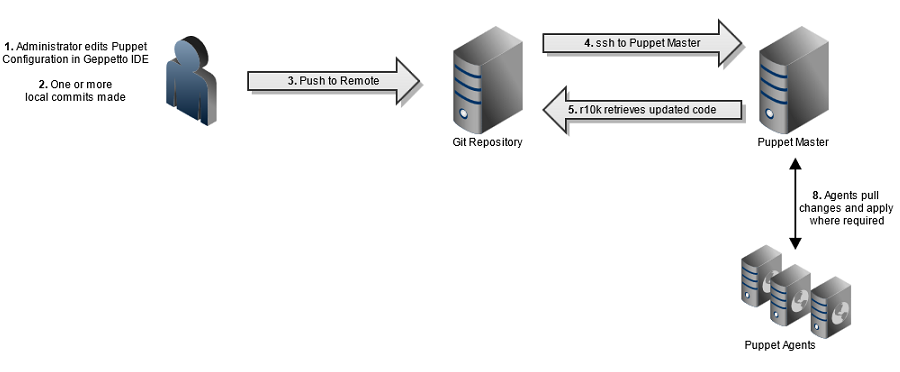

# Lab 6 - Control Repository (working with git and r10k)
## Lab tutorials

In this lab we are going to implement a workflow that involves utilising [r10k](https://github.com/puppetlabs/r10k) to deploy puppet code from a central git respository. To distinguish between environments (testing, staging, production etc.) r10k uses git branches. I.e. if we want to deploy code in a testing environment, we just create a branch for our code in git with the name `testing`. The figure below gives and overview of the workflow that we are going to implement. 

### Provision the infrastructure
1.  Launch the infrastructure. (Remember that you can always log in to
    <https://skyhigh.iik.ntnu.no> and view your Network Topology to get
    an overview of your infrastructure).
    
    Make sure you have a keypair and the linux security group. Download or 
    clone the git repo at <https://gitlab.stud.idi.ntnu.no/jhklemet/iac-heat.git> 
    and create the stack. The stack will include 3 servers: `manager` (puppetserver),  `pasture-app` and `pasture-db`.
    
        # environment file contents (iac_top_env.yaml):
        parameters:
          key_name: KEY_NAME
        
        # create the stack:
        openstack stack create -e iac_top_env.yaml -t \
         iac_top.yaml iac

2.  *Install and configure puppetserver* on `manager`:
    
        wget https://apt.puppetlabs.com/puppet6-release-bionic.deb
        sudo dpkg -i puppet6-release-bionic.deb
        sudo apt-get update
        sudo apt-get install puppetserver
        echo 'PATH=$PATH:/opt/puppetlabs/bin/' >> ~/.bashrc
        . ~/.bashrc
        sudo -i
        echo "$(facter networking.ip) $(hostname).puppetlabs.vm $(hostname)" >> /etc/hosts
        echo "$(facter networking.ip) puppet" >> /etc/hosts
        puppetserver ca setup
        puppet resource service puppetserver ensure=running enable=true
        #
        # ALSO install the agent on the server
        /opt/puppetlabs/bin/puppet config set server manager.puppetlabs.vm --section main
        /opt/puppetlabs/bin/puppet config set runinterval 300 --section main
        /opt/puppetlabs/bin/puppet resource service puppet ensure=running enable=true
    
    Puppet agent should be installed on all the servers as part of the
    install sequence (cloud-init) and set to contact the puppetserver
    once randomly in every five minute period. Check to see which
    servers have done this, and wait until all of them appear in the
    list before signing all the keys on the ´manager´.
    
        puppetserver ca list
        # all hosts should show up within 5 minutes
        # you can sign all keys with
        puppetserver ca sign --al
    
    Log in to one of the Linux servers and check that communication with
    the puppetserver is ok, should look something like this:
    
        ubuntu@pasture-app:~# sudo -i
        root@pasture-app:~# puppet agent -t
        Info: Using environment 'testing'
        Info: Retrieving pluginfacts
        Info: Retrieving plugin
        Info: Retrieving locales
        Info: Loading facts
        Info: Caching catalog for pasture-app.beauvine.vm
        Info: Applying configuration version 'manager-testing-bc9ca130abf'
        Notice: Applied catalog in 0.28 seconds
        root@pasture-app:~# 
    
    `puppet config print` is nice to know to inspect puppet’s
    configuration, try the following
    
        # where should modules be installed on the server?
        puppet config print modulepath
        # where is the manifest that assigns 
        # a configuration to a server?
        puppet config print manifest
        # how often does puppet agent run?
        puppet config print runinterval
    
    Reports from the puppet agents (do `ls -ltr` in one of the
    directories in here and look for the largest files, those contain
    reports of when puppet actually did something, the other files are
    just confirming that state is correct, remember idempotency)  
    `ls -R /opt/puppetlabs/server/data/puppetserver/reports/`  
    (You can get a fancy interface to reports if you install
    [PuppetDB](https://puppet.com/docs/puppetdb/latest) and use
    [Puppetboard](https://github.com/voxpupuli/puppetboard) or [Puppet
    Explorer](https://github.com/dalen/puppetexplorer))

### Setup Git
1.  We are now going to use the workflow with local code being pushed to
    a git server, and r10k pulling this code and creating Puppet
    environments. Make an account on a remote git server (Bitbucket,
    GitHub or GitLab) if you don’t have one already that you would like
    to use. NTNU has GitLab instances availble at gitlab.stud.idi.ntnu.no 
    and git.gvk.idi.ntnu.no that you have access to with your existing
    NTNU accounts.
    
    Create a new public key identity on `login.stud.ntnu.no` or your
    laptop (or wherever you prefer coding) AND a new public key identity
    on `manager` and upload them to your remote git-account. Choose to
    not have a password on your private key so we can automate this
    fully.

    - [GitLab and SSH keys](https://docs.gitlab.com/ee/ssh)
    - [Adding a new SSH key to your GitHub account](https://help.github.com/en/articles/adding-a-new-ssh-key-to-your-github-account)
    - [BitBucket: SSHkeys](https://confluence.atlassian.com/bitbucket/ssh-keys-935365775.html)
    
    <!-- end list -->
    
        # create a ssh key as a new identity (with blank password or use ssh agent)
        ssh-keygen -f ~/.ssh/YOUR_CHOSEN_ID -C "YOUR_CHOSEN_ID" 
        
        # edit .ssh/config to contain (replace gitlab.com if you use 
        # BitBucket or GitHub). Note that 'StrictHostKeyChecking no'
        # is only needed by r10k so it bypasses ssh' initial yes/no
        Host YOUR_CHOSEN_ID
         HostName gitlab.stud.idi.ntnu.no
         Preferredauthentications publickey
         StrictHostKeyChecking no
         IdentityFile ~/.ssh/YOUR_CHOSEN_ID
        
        cat .ssh/YOUR_CHOSEN_ID.pub 
        # and paste it into remote git account according to instructions

2.  Log into remote git and create an empty git repo named `control-repo`

3.  Clone Puppetlabs’ template for a control repo to login.stud.ntnu.no
    (or your laptop), remove its origin and add the repo you created in
    Bitbucket as the new origin, push the production branch.
    
        git clone https://github.com/puppetlabs/control-repo.git
        cd control-repo
        git remote rm origin
        git remote add origin git@YOUR_CHOSEN_ID:USERNAME/control-repo.git
        git push origin production

4.  In this lab we are going to use the `Pasture` code example from the Puppet Learning VM quest [control repository](https://github.com/puppetlabs/puppet-quest-guide/blob/master/quests/control_repository.md). You can get the files by cloning the following git repository (remember to change the directory in case you are in the control-repo directory created in the previous task):
    
        cd ..
        git clone https://gitlab.stud.idi.ntnu.no/jhklemet/puppetquest-control-repo.git
        cd puppetquest-control-repo/modules

    Copy the site-specific `cowsay`, `gem`, `pasture`, `motd`, `user_accounts`, `role`, and `profile` Puppet modules into the your control repository's `site-modules` directory.

        cp -r {cowsay,gem,pasture,motd,user_accounts,role,profile} /path/to/control-repo/site-modules/

    Copy over your existing `site.pp` manifest.
        
        cd ..
        cp manifests/site.pp /path/to/control-repo/manifests/site.pp

    The last remaining items to copy are those related to Hiera.
    First, copy over your `hiera.yaml` configuration file.

        cp hiera.yaml /path/to/control-repo/hiera.yaml

    Then recursively copy the Hiera data directory and its contents.

        cp -r data /path/to/control-repo/data

    Stage the files in your control repository for an initial commit with the `git
    add` command. In this case, you can easily add everything by using the `*`
    wildcard.  Be aware, however, that in most cases it is best to use more
    specific `git add` commands to ensure that you are always aware of which files
    you're staging for your commit.
        
        cd /path/to/control-repo
        git add *

    Use the `git status` command to see the list of files that will be added in
    your commit.

        git status

    Now that these files are staged, commit the changes. THe `-m` allows you to provide 
    a commit message. This message should include a concise title separate by one line 
    from a complete description of the changes introduced by the commit. 
    Projects and teams should develop their own conventions around the specifics of a good
    commit message to ensure that there is a complete record of all code changes.

        git commit -m "Inital commit"

5.  Modify the file `Puppetfile` in the control repo with adding the following
    contents (then commit and push of course):

        # pasture-db
        mod 'puppetlabs-postgresql', '8.2.1'
        mod 'puppetlabs-stdlib', '8.4.0'
        mod 'puppetlabs-concat', '7.3.0'

        # r10k
        mod 'puppet-r10k',            '7.0.0'
        mod 'puppetlabs-ruby',        '1.0.1'
        mod 'puppetlabs-vcsrepo',     '2.4.0'
        mod 'puppetlabs-git',         '0.5.0'
        
6. In our case, we just want two environments (I’m sure you see during
    this course how we could extend this with environments for
    development, or feature-based environments), `production` and
    `testing`. In the control repo, create a testing branch.
    
        git checkout -b testing
        git push origin testing

### Install and deploy code using r10k
7. Install required Puppet modules on `manager`:
    
        puppet module install --ignore-dependencies puppet-r10k
        puppet module install --ignore-dependencies puppetlabs-ruby
        puppet module install --ignore-dependencies puppetlabs-vcsrepo
        puppet module install --ignore-dependencies puppetlabs-git
        puppet module install --ignore-dependencies puppetlabs-stdlib
        
8. Create a file `/var/tmp/r10k.pp` and fill the file with the following content (remember to change the git credentials):
        
        class { 'r10k':
          sources => {
            'puppet' => {
              'remote'  => 'git@YOUR_CHOSEN_ID:USERNAME/control-repo.git',
              'basedir' => "/etc/puppetlabs/code/environments",
              'prefix'  => false,
            },
          },
        }
        
9. Install r10k by applying:

        puppet apply /var/tmp/r10k.pp
    
    NOTE\! when you run r10k, it will delete and replace everything in  
    `/etc/puppetlabs/code/environments/`. Meaning: anything that is not
    managed by r10k in this directory will be deleted.

8. Deploy with `r10k` on the `manager`. To deploy all environments:
        
        r10k deploy environment -pv
    
    To deploy just testing:
        
        r10k deploy environment testing -pv
        
    If you have problems check that the keys and config file are really in 
    ´/root/.ssh´ and NOT in ´/home/ubuntu/.ssh´ (this might happen if you do 
    ´sudo -s´ and not ´sudo -i´)

9. All hosts are by default in the `production` environment. Log into
    `pasture-app` and place it in the `testing` environment with  
    
        puppet config set environment testing --section agent
         
    (See what happened: `cat /etc/puppetlabs/puppet/puppet.conf`) Hosts
    can also be [assigned to environment on the
    puppetserver](https://serverfault.com/a/846662) (the puppetserver
    can override the agent).

10. On the `pasture-app` host check that the code can be applied and that you do not get any errors.
        
        puppet agent -t
    

11. Once that is done validate that the service is running as expected on
the node:

        curl 'pasture-app.beauvine.vm/api/v1/cowsay'

### Make a code change

1. In the control-repo, open the `data/domain/beauvine.vm.yaml` file.

        nano data/domain/beauvine.vm.yaml

    Edit the value of the `default_message` variable to read `'Hello control
    repository!'`.

        profile::pasture::app::default_message: "Hello control repository!"

2. Add, commit and push the code. Deploy using r10k as described above. Verify that the code change 
had effect:

        curl 'pasture-app.beauvine.vm/api/v1/cowsay'

## Review questions and problems

1.  Explain the purpose and the content of the *control repo*.

2.  Explain how `git` is used in deploying puppet code in an
    infrastructure.

3. (Bonus) Edit the Heat code to create a stack with `pasture-app-production` and `pasture-app-testing` servers and configure these to run `production` and `testing` environments, respectively. Create `production` and `testing` branches in your git repository, make some changes to the testing and production code and use r10k to deploy the code on the 2 servers. Check that the `testing` and `production` code is running on the correct servers/environments.

